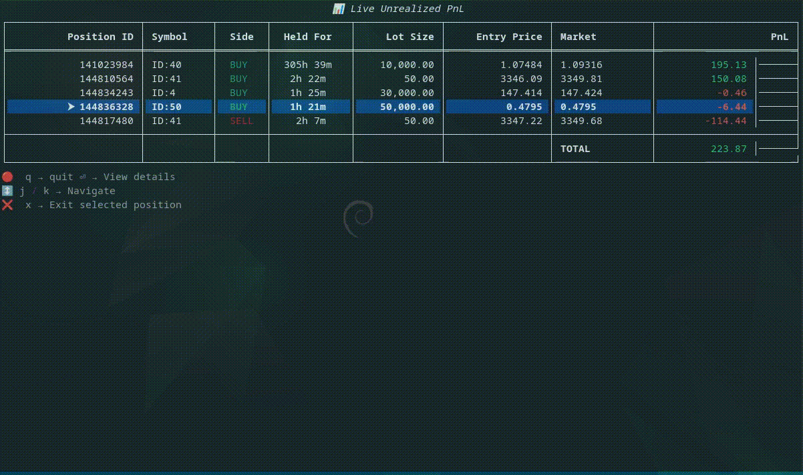

# cTrader OpenAPI CLI

A Python-powered **command-line trading toolkit** for interacting with the [cTrader Open API](https://connect.spotware.com/).
Includes account management, order execution, and a live Unrealized PnL viewer built with [Rich](https://github.com/Textualize/rich).

⚠️ **Note:** This is *not* the official cTrader CLI (Windows-only).
This project is a cross-platform, Python-based client for the cTrader Open API.


---

## Features

- 🔑 **Account Management**
  - Login with API credentials (`CLIENT_ID`, `ACCESS_TOKEN`)
  - Automatic reconnect + account reconciliation

- 📊 **Live Unrealized PnL Viewer**
  - Browse open positions in real time using a Rich-powered table and intuitive keybindings (`j/k`, `q`, `x`).
  - Navigation: `j/k` to move, `q` to quit, `x` to close position

- 📥 **Trading Actions**
  - Market, Limit, and Stop orders
  - Close positions & cancel orders
  - Deal offset support

- 🔍 **Market Data**
  - Trendbars & tick data
  - Spot price board
  - Asset and symbol categories

---

Live Unrealized PnL viewer (Rich-powered terminal UI)


---


## ⚙️ Setup

```
# 1. Clone the repo
git clone https://github.com/johnsellin93/ctrader-cli
cd ctrader-cli

pip install -r requirements.txt

# 3. Configure environment
cp .env.example .env
# then edit .env with your cTrader API keys
```

## Example .env:
```
CLIENT_ID="your-client-id"
CLIENT_SECRET="your-client-secret"
ACCESS_TOKEN="your-access-token"
REFRESH_TOKEN="your-refresh-token"
ACCOUNT_IDS="1234567,7654321"
TOKEN_URL="https://connect.spotware.com/token"
API_BASE_URL="https://api.spotware.com/connect/tradingaccounts"
```

### 🔑 Where to get these values?

- **CLIENT_ID / CLIENT_SECRET** — Create an app via the [cTrader Developer Portal](https://connect.spotware.com/apps)
- **ACCESS_TOKEN / REFRESH_TOKEN** — Obtained after authorizing your app via OAuth2
- **ACCOUNT_IDS** — Your trading account IDs (visible in cTrader once connected)
- **TOKEN_URL / API_BASE_URL** — Use the defaults above unless Spotware changes endpoints


Tech Stack

- Python (3.10+)

- Twisted (async networking)

- Protobuf (cTrader messages)

- Rich (terminal UI)

- prompt_toolkit (CLI input)

## Dependencies
This project has been tested with:

- ctrader-open-api==0.9.2
- pyautogui==0.9.54
- prompt-toolkit==3.0.51
- twisted==24.3.0
- inputimeout==1.0.4
- python-dotenv==1.0.1
- rich==13.7.0
- colorama==0.4.6


##  License & Contributions
Licensed under MIT. Contributions and feature requests are welcome! 🚀


## 🎮 CLI Menu
```
Menu Options:
 1. List Accounts
 2. Set Account
 3. Version Info
 4. List Assets
 5. List Asset Classes
 6. List Symbol Categories
 7. Show Price Board
 8. Trader Info
 9. Subscribe to Spot
10. Reconcile (Show Positions)
11. Get Trendbars
12. Get Tick Data
13. New Market Order
14. New Limit Order
15. New Stop Order
16. Close Position
17. Cancel Order
18. Deal Offset List
19. Unrealized PnL (Live Viewer)
20. Order Details
21. Orders by Position ID
22. Help
```
